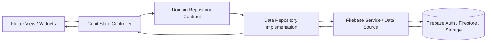

# Chat Flow


## Project Overview

**Chat Flow** is a Flutter messaging application for real-time private and group conversations. The app supports authentication, profile management, chat lists, user search, stories, text messages, image/video/voice media, group creation, group details, and message edit/delete actions.

The project targets:

- **Android**
- **iOS**
- **Web**
- Desktop shells are present for Windows, macOS, and Linux, although mobile/web are the primary product targets.

## Tech Stack

| Area | Technology |
| --- | --- |
| Core | Flutter SDK 3.x, Dart `^3.9.2` |
| State Management | `flutter_bloc` Cubit |
| Dependency Injection | `get_it` |
| Backend / Network | Firebase SDKs: `firebase_core`, `firebase_auth`, `cloud_firestore`, `firebase_storage` |
| Local Persistence | No dedicated local database currently. Runtime caching is handled through media/cache packages where needed. |
| Media | `image_picker`, `video_player`, `record`, `audioplayers`, `cached_network_image`, `flutter_cache_manager` |
| Functional Error Modeling | `dartz` `Either<Failure, T>` |
| Assets | `flutter_svg`, local auth assets |
| Integrations | Firebase Auth, Cloud Firestore, Firebase Storage. No AI automation, n8n, Manus, or Dockerized backend is currently wired. |

## Architecture & Diagrams

Chat Flow follows a **feature-first Clean Architecture** style. Each feature owns its domain, data, and presentation layers, while shared app infrastructure lives in `core/`.

The primary data flow is:



Layer responsibilities:

- **Presentation:** views, widgets, Cubits, UI state, navigation side effects.
- **Domain:** entities and abstract repository contracts.
- **Data:** Firebase services, models, repository implementations.
- **Core:** routing, dependency injection, theme, shared widgets, errors, validators.

## Project Structure

```text
lib/
  main.dart
  core/
    cubits/              # Shared app-level Cubits such as theme state
    errors/              # Failure and CustomException types
    services/            # Dependency injection and shared services
    utils/               # Routes, colors, themes, validators, assets
    widgets/             # Shared reusable UI widgets
  features/
    auth/
      data/              # Firebase auth service, models, repo implementation
      domain/            # Auth entities and repo contract
      presentation/      # Login/register/splash Cubits, views, widgets
    home/
      data/              # Conversations, users, stories Firestore services
      domain/            # Conversation, user, story entities and repo contract
      presentation/      # Home screen, stories, chat list, search UI
    message/
      data/              # Private message Firestore service and repo
      domain/            # Message entity, status, type, repo contract
      presentation/      # Message screen, composer, bubbles, media widgets
    groups/
      data/              # Group Firestore/Storage service and repo
      domain/            # Group entity and repo contract
      presentation/      # Groups tab, new group, group chat, details UI
    settings/
      data/              # Profile/settings Firebase service and repo
      domain/            # Settings user entity and repo contract
      presentation/      # Settings/profile Cubit, views, widgets
```

## Implementation Details

### Environment Configuration

The project currently uses standard Flutter/Firebase platform configuration files:

- `android/app/google-services.json`
- iOS/macOS Firebase configuration should be added through the normal Firebase setup flow.
- `firebase.json` exists at the project root.

There is no `.env` file, flavor setup, or runtime environment switcher currently implemented. If staging/production separation is needed, add Flutter flavors and separate Firebase app configurations per platform.

### Dependency Injection

Dependency injection is centralized in:

```text
lib/core/services/get_it_service.dart
```

The app registers Firebase instances and repository/service dependencies with `get_it`. Feature Cubits receive abstract repository contracts, keeping presentation logic independent from Firebase implementations.

### Error Handling & API Response Modeling

The app uses a consistent error flow:

```text
Firebase Service throws CustomException
Repository catches errors
Repository returns Either<Failure, T>
Cubit folds result into SuccessState / ErrorState
UI shows snackbars or loading overlays
```

Core types:

- `CustomException`
- `Failure`
- `ServerFailure`
- `Either<Failure, T>` from `dartz`

Firestore streams are used for real-time conversations, groups, stories, and messages. Write operations validate input in services and return repository-level failures to Cubits.

## Getting Started

### Prerequisites

- Flutter SDK compatible with Dart `^3.9.2`
- Dart SDK 3.9.2 or newer within the supported Flutter channel
- Firebase project configured for Android/iOS/Web
- Android Studio or Xcode for native builds
- Optional: FVM if your team pins Flutter versions

### Install Dependencies

```bash
flutter pub get
```

### Firebase Setup

Ensure Firebase configuration files are present for the platforms you plan to run:

```text
android/app/google-services.json
ios/Runner/GoogleService-Info.plist
macos/Runner/GoogleService-Info.plist
```

### Code Generation

This project currently does **not** use `build_runner`, Freezed, Retrofit, or generated model code.

If code generation is introduced later, use:

```bash
dart run build_runner build --delete-conflicting-outputs
```

### Run The App

```bash
flutter run
```

Run on a specific device:

```bash
flutter devices
flutter run -d <device-id>
```

Run for web:

```bash
flutter run -d chrome
```

### Analyze & Test

```bash
flutter analyze
flutter test
```

## CI/CD & Deployment

No CI/CD pipeline is currently committed in this repository.

Recommended future automation:

- **GitHub Actions** for `flutter analyze`, `flutter test`, and build validation.
- **Codemagic** for managed Flutter mobile pipelines.
- **Fastlane** for Android/iOS signing, screenshots, and store deployment.
- Firebase App Distribution for internal QA builds.

Suggested GitHub Actions checks:

```text
checkout
setup-flutter
flutter pub get
flutter analyze
flutter test
flutter build apk --debug
```

## Notes

- The app name is configured as **Chat Flow** across Android, iOS, Web, Windows, macOS, and Linux launcher/window metadata.
- Message delete currently removes the Firestore message document only. Uploaded media files are not deleted from Firebase Storage.
- For production security, Firestore and Storage rules should enforce group membership and message ownership on the backend, not only in client-side logic.
